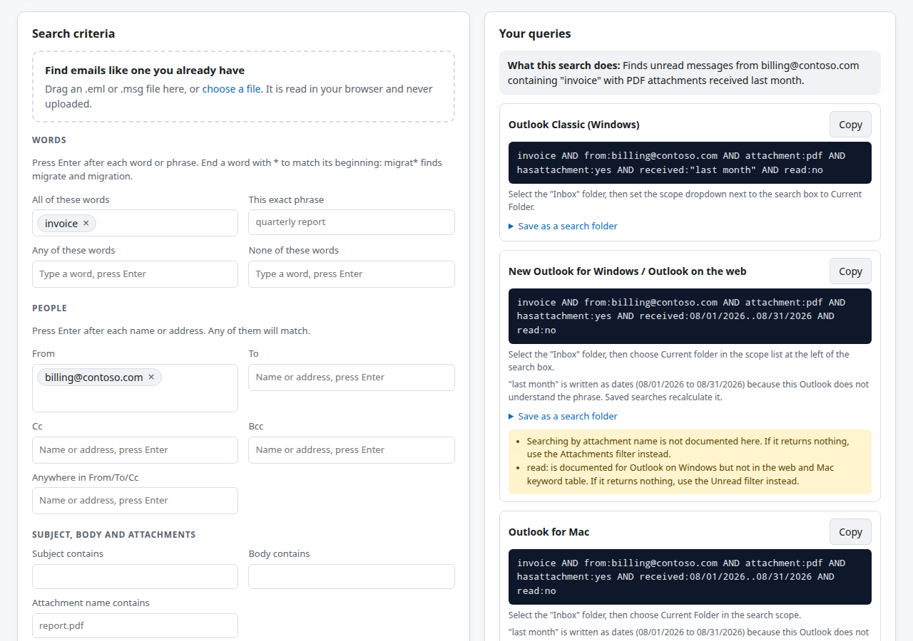

# Outlook Search Builder

[](https://github.com/jambot24/outlook-search-builder/actions/workflows/ci.yml)
[](LICENSE)

**Live site: https://outlook-search-builder.pages.dev**

A one-page tool that turns "what I am looking for" into search text that works in Outlook. You
fill in a form, or drop in an email you already have, and it writes the query for each version
of Outlook:

- Outlook Classic for Windows
- New Outlook for Windows and Outlook on the web
- Outlook for Mac
- Outlook mobile (iOS and Android)



## Why it exists

The Outlook versions do not share one search syntax, and Outlook gives no help writing one.

- **Keywords differ.** Classic understands `messagesize:>5 MB` and `hasflag:true`. The newer
  versions use `isflagged:yes` and do not document size searches.
- **Dates differ.** Classic accepts `received:"last month"`. New Outlook documents only today,
  yesterday, this week and last week, so the tool writes other periods as a date range.
- **Some things cannot be searched at all.** No version has a folder keyword, and none can read
  message headers such as `List-Unsubscribe`. The tool says so instead of producing a query that
  silently returns nothing.

`docs/SYNTAX.md` lists every keyword, its support in each version, and the Microsoft page it
comes from. We built the queries from Microsoft's documentation and have not yet tested every
one in a live copy of each version. Reports are welcome (see Contributing).

## Features

- **Queries for every version at once.** Each has its own Copy button, the steps to set the right
  folder scope, and a plain-English sentence saying what the search finds.
- **Chip inputs.** Press Enter after each name, word or phrase. A phrase such as "opt out" stays one
  term without typing quotes.
- **File types.** PDF, Word, Excel, PowerPoint, CSV, images, archives, calendar files and attached
  emails.
- **Dates that stay current.** Relative words are used wherever a version understands them. Other
  periods, and "in the last N days", "more than N days ago" and "between N and M days ago", become
  exact dates that saved searches recalculate.
- **Wildcards.** A trailing `*` (`migrat*`) where Microsoft documents it. Classic matches word
  beginnings without it.
- **Search library.** Built-in searches in categories, including an Inbox zero set where each
  search says what to do with the results.
- **Find similar.** Drop an `.eml` or `.msg` file to build a search from its sender, subject,
  attachments and date. The file is read in the browser and is never uploaded or stored.
- **Search folder steps.** How to keep a search as a Search Folder in each version: dialog fields in
  Classic, the closest ready-made folder in new Outlook, Save Search on Mac.
- **Saved searches and sharing.** Searches are saved in the browser, can be exported as JSON or CSV,
  and can be shared as a link.
- **Community library (not yet switched on).** Signed-in users will be able to share searches, add a
  140-character description, vote and report. See "Community features" below.

## Privacy

- **Everything runs in the browser.** Queries, saved searches and dropped emails never leave the
  page.
- **Share links** keep the search in the URL fragment (`#q=`), which browsers do not send to
  servers.
- **Signing in is optional.** It asks only for your identity. Mail folder names are read, with the
  `Mail.ReadBasic` permission, only when you click "Load my folders".
- **Community submissions** store the search, its title and description, and a one-way hash of
  your account ID. They do not store your name or email address.

## Project layout

```
public/                  the site Cloudflare Pages serves
  index.html, styles.css
  js/query.js            criteria -> query text per version
  js/explain.js          criteria -> plain-English description
  js/searchfolder.js     criteria -> search folder steps per version
  js/library.js          built-in searches and categories
  js/email.js            .eml / .msg parsing and "find similar" suggestions
  js/filetypes.js        file type groups
  js/storage.js          saved searches, export, import
  js/app.js ...          page wiring (no build step)
  vendor/msgreader.js    browser bundle of @kenjiuno/msgreader (see THIRD_PARTY_NOTICES.md)
functions/               Cloudflare Pages Functions: the community API
migrations/              D1 database schema
tests/                   node --test suites, including a local D1 via wrangler
docs/SYNTAX.md           keyword support per version, with sources
```

The front end is plain HTML, CSS and ES modules. There is no framework and no build step for the
site itself. `npm run build:vendor` rebuilds the `.msg` parser bundle.

## Development

Requires Node.js 20 or later.

```bash
npm ci
npm test            # every suite, with coverage
npm run serve       # http://localhost:8788
```

The backend tests start a throwaway local D1 database through wrangler, so they need no Cloudflare
account.

## Community features

The community API is deployed but answers `503` until four things exist.

1. **An Entra app registration.**
   - Supported account types: "Accounts in any organizational directory and personal Microsoft
     accounts".
   - Platform: single-page application, with redirect URI `https://<site>/auth/redirect.html`.
   - Put its client ID in `public/js/config.js` and in `MSAL_CLIENT_ID` in `wrangler.toml`.
2. **A Cloudflare Turnstile widget.** The site key goes in `public/js/config.js`. The secret goes
   into the Pages secret `TURNSTILE_SECRET_KEY`.
3. **A D1 database.** Create it, add its binding to `wrangler.toml`, and apply
   `migrations/0001_init.sql`.
4. **A redeploy.**

Moderation is automatic:

- **Hiding:** an item is hidden after three reports or at a score of -5.
- **Overrides:** setting `moderation` to `approved` or `hidden` in the database overrides the
  automatic rule.

## Deployment

Cloudflare Pages builds from `main`, with `public/` as the output directory and `functions/` as the
API. There is no build command.

## Contributing

Reports of what works in a real copy of Outlook are the most useful contribution. Use the "Query
result report" issue template. See [CONTRIBUTING.md](CONTRIBUTING.md) for how to add a built-in
search or change a keyword.

## Support

If the tool saves you time, you can [buy me a coffee](https://buymeacoffee.com/kevinspellman).

## License

MIT, see [LICENSE](LICENSE). The bundled `.msg` parser and its dependencies keep their own
licenses, listed in [THIRD_PARTY_NOTICES.md](THIRD_PARTY_NOTICES.md). Outlook, Microsoft 365 and
Microsoft Teams are trademarks of Microsoft. This project is not affiliated with or endorsed by
Microsoft.
